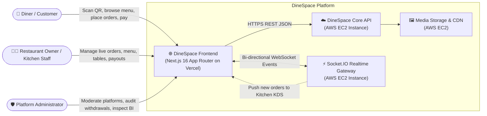
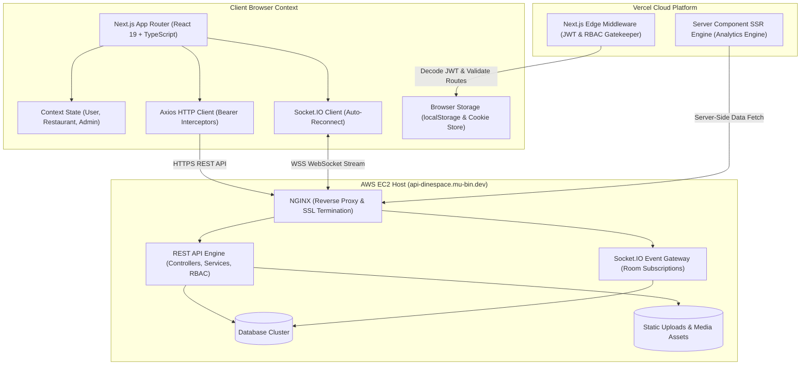
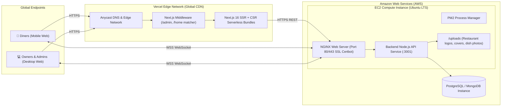
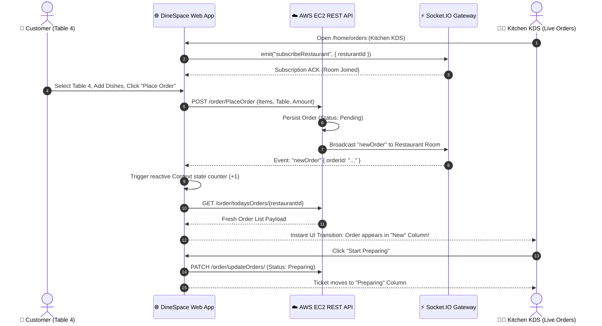
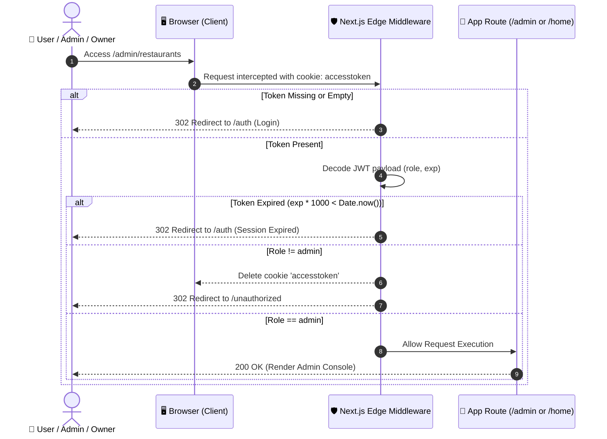

# 🍽️ DineSpace — Contactless Dining & Real-Time Restaurant Management System

[](https://nextjs.org/)
[](https://react.dev/)
[](https://www.typescriptlang.org/)
[](https://tailwindcss.com/)
[](https://daisyui.com/)
[](https://socket.io/)
[](https://zod.dev/)
[](https://vercel.com/)
[](https://aws.amazon.com/ec2/)

---

## 📌 Quick Links & Deployments

| Component | Target / URL | Description |
|---|---|---|
| 🌐 **Frontend Live Application** | [dinespace.mu-bin.dev](https://dinespace.mu-bin.dev) | Deployed on **Vercel Edge Platform** |
| ☁️ **Backend API & Gateway** | [api-dinespace.mu-bin.dev](https://api-dinespace.mu-bin.dev) | Deployed on **AWS EC2 Instance** (REST + Socket.IO) |
| 📦 **Backend Repository** | [mubin25-dodu/DineSpace](https://github.com/mubin25-dodu/DineSpace) | Node.js / Express / NestJS backend source code |
| 💻 **Frontend Repository** | [mubin25-dodu/DineSpace_Frontend](https://github.com/mubin25-dodu/DineSpace_Frontend) | Next.js 16 App Router repository |

---

## ⚡ Instant Recruiter & Demo Access

Recruiters and evaluators can immediately experience the live multi-tenant restaurant owner dashboard:
- Simply click the **"Dummy Login"** button directly on the [DineSpace Landing Page](https://dinespace.mu-bin.dev) (header or hero section) for instant one-click authentication.
- Or use the pre-configured owner credentials on `/auth`:
  - **Email**: `mubin9516@gmail.com`
  - **Password**: `Mubin@11`
  - **Role**: Restaurant Owner ➔ Routes directly to `/home` (Live Orders KDS, Menu Management, Table QR Codes, Wallet)

---

## 📖 Executive Summary

**DineSpace** is an enterprise-grade, full-stack multi-tenant restaurant operating platform and contactless dining solution built to modernize food service hospitality. DineSpace bridges the communication gap between patrons, kitchen staff, and business administrators by replacing outdated physical menus and friction-heavy waiter interactions with an intuitive, real-time, event-driven web application.

### Why DineSpace Exists
Traditional dining experiences suffer from persistent bottlenecks:
1. **Customer Frustration**: Waiting indefinitely for physical menus, waving down waiters to ask about specials, and waiting again to place simple add-on orders or bill settlements.
2. **Operational Inefficiency**: Front-of-house staff spend up to 40% of their time taking routine orders, communicating table states, and relaying tickets to the kitchen, leading to order inaccuracies and table turnover delays.
3. **Fragmented Oversight**: Restaurant owners struggle with multi-branch management, disparate order streams, table occupancy tracking, and delayed financial reconciliation.

**DineSpace solves this end-to-end**:
- **Diners** scan a table QR code or browse online, explore categorized menus with high-resolution imagery, submit orders and add-ons directly from their smartphones, and track preparation status in real time.
- **Restaurant Kitchens & Managers** receive instant, zero-refresh kitchen tickets via **Socket.IO** rooms, update table occupancy states interactively, toggle item availability on the fly, and process refunds and wallet withdrawals.
- **Platform Administrators** monitor the health of all registered restaurants, review withdrawal payouts, moderate accounts, and inspect high-performance **Server-Side Rendered (SSR)** business analytics.

---

## 🏛️ System Architecture

DineSpace adopts a **hybrid distributed architecture** combining edge-rendered web interfaces, event-driven WebSocket channels, and dedicated cloud compute services.

### 1. High-Level C4 Context Diagram (System Level)



---

### 2. Container Architecture Diagram



---

### 3. Production Deployment Topology



---

### 4. Real-Time Order Lifecycle & Event Flow



---

### 5. Role-Based Edge Authentication & Route Guarding



---

## 🚀 Key Feature Matrix

### 🍽️ 1. Customer (Diner) Experience
* **Contactless Table-Side Discovery**: Scan table QR codes or browse registered restaurants near you.
* **Rich Visual Menus**: View items segmented by category (Appetizers, Mains, Beverages, Desserts), accompanied by high-resolution imagery and live availability indicators.
* **Custom Cart ("My Bowl")**: Seamless cart management with real-time recalculations of sub-totals, delivery charges, discounts, and payable amounts.
* **Add-On Dining Orders**: Already seated and need an extra drink or side? Diners can push add-on orders directly linked to their active table ticket.
* **Simulated & Direct Payment Checkouts**: Choose between instant digital payment simulation or counter settlement depending on the restaurant's operational mode (`payfirst`).
* **Live Order Tracking**: Lookup and track active preparation progress (`Pending` ➔ `Confirmed` ➔ `Preparing` ➔ `Ready` ➔ `Completed`).

### 👨‍🍳 2. Restaurant Owner Operations Hub
* **Multi-Branch Operations**: Switch seamlessly between multiple restaurant profiles from a single owner account.
* **Real-Time Kitchen Display System (KDS)**: Kanban-style order board (`Liveorders.tsx`) automatically synchronized via WebSocket rooms (`New` ➔ `Preparing` ➔ `Ready`). Zero manual refreshes needed.
* **Visual Table Manager**: Interactive table grid with seat capacities and real-time state transitions:
  - 🟢 `Available` | 🔴 `Occupied` | 🟡 `Reserved` | 🧹 `Cleaning`
* **Automated QR Code Generator**: One-click generation of digital menu and table QR codes with instant PNG download for printing physical table tents.
* **Menu & Category Catalog**: Full CRUD for dishes, image upload pipelines, category assignments, pricing adjustments, and instantaneous availability toggles (`toggleAvailabel`).
* **Financial Ledger & Wallet Payouts**:
  - Track real-time restaurant wallet balance.
  - Review historical payment logs and issue customer refunds (`wallet/refund/{paymentId}`).
  - Submit bank or mobile financial service (bKash / Nagad) withdrawal requests validated with strict minimum thresholds (500 BDT).

### 🛡️ 3. Platform Administration & Business Intelligence
* **Platform Governance**: Complete directory of registered restaurants with search, phone/email contact details, and one-click **Ban / Unban** moderation toggles.
* **High-Performance SSR Analytics (`/admin/restaurants/[id]`)**:
  - Leverages Next.js Server Components with `cache: "no-store"` for instant business intelligence without client-side waterfalls.
  - Core KPIs: **Total Revenue**, **Gross Profit**, **Order Count**, **Refund Volume**, and **Average Order Value (AOV)**.
  - Granular monthly earnings breakdown table (Revenue, Refunds, Profit, Order volume).
* **Withdrawal Governance & Payout Approval (`/admin/withdrawals`)**:
  - Filter withdrawal requests by `Pending`, `Approved`, or `Rejected`.
  - Comprehensive search across withdrawal IDs, restaurant names, account numbers, and payment methods.
  - One-click Accept or Reject operations with status updating.

---

## 💻 Tech Stack & Engineering Rationale

| Category | Technology | Version | Architectural Justification |
|---|---|---|---|
| **Core Framework** | [Next.js (App Router)](https://nextjs.org/) | `^16.3.0` | Enables hybrid rendering: High-speed SSR for Admin Analytics and SEO landing pages, combined with CSR for interactive kitchen displays. |
| **UI Library** | [React](https://react.dev/) | `^19.2.8` | Next-generation React 19 runtime with the React Compiler enabled for automated dependency memoization. |
| **Language** | [TypeScript](https://www.typescriptlang.org/) | `^5.0.0` | End-to-end type safety across API contracts, domain entities, and component props. |
| **Styling Engine** | [Tailwind CSS](https://tailwindcss.com/) & [DaisyUI](https://daisyui.com/) | `v4.3` / `v5.7` | Utility-first styling paired with accessible, pre-built component classes tailored to a warm terracotta design palette. |
| **Real-Time Transport** | [Socket.IO Client](https://socket.io/) | `^4.8.3` | Low-latency, bi-directional WebSocket protocol for instantaneous order dispatch to kitchen screens without HTTP polling overhead. |
| **Data Fetching** | [Axios](https://axios-http.com/) | `^1.19.0` | Interceptor-driven HTTP client automatically managing authorization Bearer tokens and uniform error handling. |
| **Form Management** | [React Hook Form](https://react-hook-form.com/) | `^7.85.0` | High-performance, un-controlled form execution minimizing unnecessary re-renders on complex inputs. |
| **Schema Validation** | [Zod](https://zod.dev/) | `^4.4.3` | Runtime type inference and schema validation for auth, menu editing, and financial withdrawal rules. |
| **Icons & Media** | [Lucide React](https://lucide.dev/) & [FontAwesome](https://fontawesome.com/) | Latest | Clean, consistent, lightweight SVG icon system. |
| **Frontend Hosting** | [Vercel](https://vercel.com/) | Edge Network | Global serverless CDN, automated Git preview deployments, and sub-millisecond Edge Middleware execution. |
| **Backend Compute** | [AWS EC2](https://aws.amazon.com/ec2/) | Ubuntu / NGINX | Dedicated cloud instance running Node.js REST controllers, persistent WebSocket daemon, and local image asset directory. |

---

## ⚙️ Technical Highlights & Engineering Decisions

### 1. Dual-Tier Authentication & Edge Middleware
DineSpace implements a defense-in-depth authentication strategy:
- Upon login (`POST /auth/login`), the JWT token is mirrored into both `localStorage` (for browser-side Axios interceptors) and a browser cookie (`accesstoken`).
- **Next.js Edge Middleware (`src/middleware.ts`)** intercepts incoming requests before routes are rendered. It decodes the JWT, verifies expiration (`exp * 1000 < Date.now()`), and asserts role authorization against path matchers (`/home/*` for Owners, `/admin/*` for Admins).
- Non-authenticated requests are instantly redirected to `/auth`, and unauthorized attempts are deflected to `/unauthorized`.

### 2. Event-Driven Kitchen Display System (KDS)
Rather than draining battery and bandwidth with continuous HTTP polling:
- When a restaurant owner opens their workspace, `HomeLayout` initializes a resilient Socket.IO client, authenticating with the active JWT.
- The client emits `subscribeRestaurant` with the currently selected `resturantId`.
- When an order is placed anywhere in the world, the AWS EC2 backend emits `newOrder` exclusively to that restaurant's private room.
- DineSpace catches the event, updates reactive React context state, and triggers an atomic re-fetch of live orders, transitioning the Kanban board with zero page reloads.

### 3. Server-Side Rendered (SSR) Business Intelligence
- In `/src/app/admin/restaurants/[id]/page.tsx`, the admin analytics dashboard is written as an **async React Server Component**.
- The server extracts the `accesstoken` cookie, reaches out directly to the AWS EC2 API (`/resturant/AdminAnalytics/{id}`) using `cache: "no-store"`, and compiles the complete KPI grid on the server.
- This eliminates cumulative layout shift (CLS), speeds up First Contentful Paint (FCP), and guarantees that admins always see fresh financial figures.

### 4. Cohesive Design System & Color Palette
DineSpace adheres to a bespoke, warm, appetite-stimulating aesthetic inspired by culinary warmth:
- **Primary Terracotta**: `#A13924` (Buttons, brand highlights, active badges)
- **Warm Canvas Background**: `#FBF9F6` (Prevents eye fatigue during long kitchen shifts)
- **Neutral Accent Border**: `#DEC0BA` (Subtle card delineations and table frames)
- **Success Mint**: `#188260` (Open statuses, positive profits, completed tickets)

---

## 📁 Repository Structure

```text
DineSpace_Frontend/
├── public/                         # Static image assets, fallbacks, and brand illustrations
│   ├── dinespace-landing.png       # Landing page hero visual
│   ├── DineSpace.png               # Platform primary logo
│   └── brokenOrderImage.jpg        # Missing image placeholder fallback
├── src/
│   ├── app/                        # Next.js App Router (File-system routing)
│   │   ├── admin/                  # 🛡️ Administrator Portal
│   │   │   ├── restaurants/        # Restaurant moderation list & search
│   │   │   │   └── [id]/           # Server-rendered (SSR) restaurant analytics
│   │   │   ├── withdrawals/        # Payout review and approval console
│   │   │   └── layout.tsx          # Admin layout shell
│   │   ├── auth/                   # 🔐 Authentication (Login, Email verification)
│   │   ├── home/                   # 👨‍🍳 Restaurant Owner Operations Hub
│   │   │   ├── bookings/           # Reservation and booking views
│   │   │   ├── menu/               # Menu catalog, dish editor, category manager
│   │   │   ├── orders/             # Live KDS Kanban board & order manager
│   │   │   ├── payments/           # Financial transactions & refund portal
│   │   │   ├── restaurants/        # Restaurant profile & QR code generator
│   │   │   ├── tables/             # Table floor plan & live status manager
│   │   │   ├── wallet/             # Restaurant balance & withdrawal requests
│   │   │   └── layout.tsx          # Socket.IO connection & restaurant selector
│   │   ├── registration/           # 📝 Self-serve restaurant onboarding wizard
│   │   ├── user/                   # 🍽️ Customer-facing Dining Interface
│   │   │   ├── Resturant/[id]/     # Dynamic menu browsing by restaurant
│   │   │   ├── checkout/[id]/      # Checkout & payment processing
│   │   │   ├── myBowl/             # Live cart & order preparation
│   │   │   ├── myorders/           # Order tracking & order history
│   │   │   └── page.tsx            # Restaurant discovery feed
│   │   ├── globals.css             # Tailwind v4 theme definitions
│   │   ├── layout.tsx              # Root HTML layout and typography
│   │   └── page.tsx                # Public landing page with developer story
│   ├── components/                 # Reusable, modular UI components
│   │   ├── admin/                  # Admin-specific navigation and tables
│   │   ├── userComponents/         # Customer navigation, dish cards, and bowls
│   │   ├── alertPopup.tsx          # Global animated feedback toast
│   │   ├── KPICards.tsx            # Metric cards for revenue and order totals
│   │   ├── Liveorders.tsx          # Real-time WebSocket Kanban order component
│   │   ├── OwnerNav.tsx            # Owner portal navigation bar
│   │   └── serverError.tsx         # Backend error modal wrapper
│   ├── lib/                        # Core utilities, API clients, and constants
│   │   ├── algorithms/             # Image normalization and bowl recalculation
│   │   ├── api/                    # Axios instance with Bearer interceptor
│   │   ├── context/                # React Contexts (User, Restaurant, Admin)
│   │   ├── interfaces/             # Strict TypeScript domain interfaces
│   │   └── websock/                # Socket.IO client singleton
│   ├── schemas/                    # Zod validation schemas (Auth, Menu, Withdrawals)
│   └── middleware.ts               # Next.js Edge route guard & role gatekeeper
├── .env.example                    # Environment variable template
├── next.config.ts                  # Next.js compiler & remote image host configuration
├── package.json                    # Project dependencies and operational scripts
├── tsconfig.json                   # TypeScript compiler configuration
└── PROJECT_REPORT.md               # Detailed academic project report
```

---

## 📡 API Integration & Endpoint Catalog

The frontend interacts with the AWS EC2 backend (`https://api-dinespace.mu-bin.dev`) across several key domain areas:

| Module | Method | Endpoint | Description |
|---|---|---|---|
| **Authentication** | `POST` | `/auth/login` | Authenticate credentials and receive JWT |
| | `POST` | `/auth/Verifyemail` | Request email verification code |
| | `POST` | `/auth/register/{id}` | Complete owner & restaurant registration |
| **Profile** | `GET` | `/user/Getme` | Retrieve authenticated user profile and owned restaurants |
| **Restaurants** | `GET` | `/resturant/getAllResturants` | Fetch active restaurants for customer discovery |
| | `GET` | `/resturant/getResturentById/{id}` | Get restaurant public profile, logo, and cover |
| | `GET` | `/resturant/getMyresturants` | List restaurants owned by current authenticated user |
| | `POST` | `/resturant/CreateResturant` | Create a new restaurant profile |
| | `PATCH` | `/resturant/UpdateResturant` | Update operational hours, phone, and policies |
| | `DELETE` | `/resturant/DeleteResturant/{id}` | Delete restaurant profile |
| **Analytics (SSR)** | `GET` | `/resturant/AdminAnalytics/{id}` | Server-rendered financial and operational analytics |
| **Menu** | `GET` | `/menu/GetMenu/{restaurantId}` | Retrieve all menu items and active pricing |
| | `POST` | `/menu/CreateMenu` | Create new dish with image upload |
| | `PATCH` | `/menu/UpdateMenu` | Update dish details or pricing |
| | `DELETE` | `/menu/DeleteMenuItem/{id}` | Remove dish from restaurant catalog |
| | `PATCH` | `/menu/toggleAvailabel/{id}` | Instantly toggle dish in-stock / out-of-stock |
| | `GET` | `/menu/GetCategories` | Fetch all available menu categories |
| **Orders** | `POST` | `/order/PlaceOrder` | Create initial customer table order |
| | `POST` | `/order/PlaceAddOnOrder` | Append add-on items to an existing dining order |
| | `GET` | `/order/GetallOrders/{restaurantId}` | Paginated list of restaurant orders |
| | `GET` | `/order/todaysOrders/{restaurantId}` | Fetch active orders for kitchen KDS |
| | `PATCH` | `/order/updateOrders/` | Update status (`Preparing`, `Ready`, `Completed`) |
| **Tables** | `GET` | `/tables/getTablesByResturantId/{id}` | Fetch tables and current seating status |
| | `POST` | `/tables/createTable` | Add table with seating capacity |
| | `PATCH` | `/tables/updateTableState` | Change state (`Available`, `Occupied`, etc.) |
| **Wallet & Payouts** | `GET` | `/wallet/wallet/{restaurantId}` | Fetch current balance and transaction log |
| | `POST` | `/wallet/WidthdrawRequest/{restaurantId}` | Submit withdrawal request (bKash, Nagad, Bank) |
| | `GET` | `/wallet/withdrawals?status={status}` | Admin list of withdrawal requests by status |
| | `PATCH` | `/wallet/withdrawal/{id}/status` | Admin Approve or Reject withdrawal |
| | `POST` | `/wallet/refund/{paymentId}` | Issue refund for a canceled or disputed order |

---

## 🛠️ Getting Started & Local Development

### Prerequisites
- **Node.js**: `v20.x` or `v22.x` (LTS recommended)
- **Package Manager**: `npm` (v10+), `pnpm`, or `yarn`
- **Git**: Installed and configured

### 1. Clone the Repository
```bash
git clone https://github.com/mubin25-dodu/DineSpace_Frontend.git
cd DineSpace_Frontend
```

### 2. Configure Environment Variables
Copy the environment template:
```bash
cp .env.example .env
```
Ensure `NEXT_PUBLIC_API_URL` points to your backend instance:
```env
# For local backend development:
NEXT_PUBLIC_API_URL=http://localhost:3001

# Or connect directly to the live AWS EC2 backend:
# NEXT_PUBLIC_API_URL=https://api-dinespace.mu-bin.dev/
```

### 3. Install Dependencies
```bash
npm install
```

### 4. Run Development Server
```bash
npm run dev
```
Open [http://localhost:3000](http://localhost:3000) in your browser.

### 5. Build for Production
```bash
npm run build
npm run start
```

### 6. Linting & Type Checking
```bash
npm run lint
```

---

## ☁️ Deployment Architecture & Guide

### Frontend Deployment (Vercel)
1. Import the `mubin25-dodu/DineSpace_Frontend` repository into your **Vercel** dashboard.
2. Under **Environment Variables**, set:
   - `NEXT_PUBLIC_API_URL`: `https://api-dinespace.mu-bin.dev/`
3. Configure the build settings:
   - **Framework Preset**: Next.js
   - **Build Command**: `next build`
   - **Install Command**: `npm ci`
4. Deploy. Vercel automatically deploys edge middleware and serverless functions globally.

### Backend Deployment (AWS EC2)
The backend service is maintained in [mubin25-dodu/DineSpace](https://github.com/mubin25-dodu/DineSpace).
- Hosted on an **Ubuntu AWS EC2 Instance**.
- **NGINX** handles SSL termination via Let's Encrypt (Certbot), reverse proxies HTTPS requests to the local Node.js process (`localhost:3001`), and upgrades `Connection` headers for WebSocket traffic (`/socket.io/`).
- **PM2** ensures zero-downtime execution and automatic process restarts.

---

## 🛡️ Security Best Practices & Roadmap

- **Zero-Trust Edge RBAC**: Protected routes (`/admin/*`, `/home/*`) are gated in Next.js middleware, preventing unauthenticated clients from viewing restricted shells.
- **Strict Input Validation**: All user submissions (forms, withdrawals, menu prices, Bangladeshi phone numbers) are rigorously validated using **Zod** schemas before dispatch.
- **Sanitized Media Ingestion**: Image uploads are typed, size-capped, and safely hosted on dedicated EC2 endpoints with fallback handlers.
- **Future Security Roadmap**:
  - Migrate JWT access tokens entirely to `HttpOnly`, `SameSite=Strict`, `Secure` cookies to eliminate any residual XSS risks.
  - Implement automated refresh token rotation.
  - Integrate Playwright end-to-end integration tests across customer checkout and owner withdrawal pipelines.

---

## 👨‍💻 Author & Engineering Credits

Crafted with dedication by:

**Abdullah Al Mubin**  
*Full-Stack Engineer*  
- **GitHub**: [@mubin25-dodu](https://github.com/mubin25-dodu)  
- **Frontend Repository**: [DineSpace_Frontend](https://github.com/mubin25-dodu/DineSpace_Frontend)  
- **Backend Repository**: [DineSpace](https://github.com/mubin25-dodu/DineSpace)  

---

<div align="center">
  <sub>Built for the future of hospitality. © DineSpace. All rights reserved.</sub>
</div>
